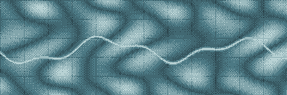
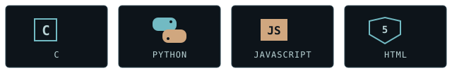

SCIENTIFIC COMPUTING / FIELD DESK 01

<h1>Ramal Maharramli</h1>

<strong>MRL</strong> &nbsp;·&nbsp; Geophysics Engineering × Programming × Building

<a href="https://github.com/MRL-creator?tab=repositories">PROJECTS</a>
&nbsp;·&nbsp;
<a href="https://github.com/MRL-creator?tab=overview">GITHUB ACTIVITY</a>
&nbsp;·&nbsp;
<a href="https://az.linkedin.com/in/ramal-maharramli-040260330">LINKEDIN</a>

---

## Field note

I study **Geophysics Engineering at the French-Azerbaijani University (UFAZ)**. I’m interested in the path from scientific questions to data, algorithms, and useful software. My projects range from C terminal games to Python and JavaScript tools.

## Geophysics × programming

I’m curious about how computational thinking can help explore scientific questions. This dithered wave field and moving seismic-style trace are visual shorthand for the path from geophysical signals to computation.

## Selected builds

<table>
<tbody>
<tr>
<td valign="top" width="50%">
01 / SEARCH · C 
<strong>Connect Four</strong> 
Terminal PvP and PvAI. The AI uses depth-limited minimax, alpha-beta pruning, and board evaluation.  
<a href="https://github.com/MRL-creator/Connect-Four-Game-C-Language">VIEW SOURCE →</a>
</td>
<td valign="top" width="50%">
02 / AUTOMATION · JAVASCRIPT 
<strong>Gmail Cleaner</strong> 
Google Apps Script for older verification codes and login links, with dry-run and starred/important safeguards.  
<a href="https://github.com/MRL-creator/gmail-cleaner">VIEW SOURCE →</a>
</td>
</tr>
<tr>
<td valign="top" width="50%">
03 / DESKTOP · PYTHON 
<strong>Attendance Tracker</strong> 
An offline Windows desktop app that records attendance in CSV files.  
<a href="https://github.com/MRL-creator/attendance-tracker">VIEW SOURCE →</a>
</td>
<td valign="top" width="50%">
04 / TERMINAL · C 
<strong>Snake</strong> 
A terminal game with keyboard controls, collisions, and speed that increases as food is collected.  
<a href="https://github.com/MRL-creator/Snake-Game-in-C-Terminal-Based-">VIEW SOURCE →</a>
</td>
</tr>
</tbody>
</table>

## Tools in use

**Languages** &nbsp; `C` &nbsp; `Python` &nbsp; `JavaScript` &nbsp; `HTML` 
**Project tooling and formats** &nbsp; Google Apps Script · CSV · PyInstaller

## Field desk

- **Education** — Geophysics Engineering, French-Azerbaijani University (UFAZ).
- **Community** — Vice President of the UFAZ Programming Club; organized and taught Python courses.
- **ICSC 2026** — Participant in the International Computer Science Competition Qualification Round.

## Current direction

Python · algorithms · data structures · scientific computing

## Live activity

GitHub’s native contribution calendar and repository activity are available on my [profile overview ↗](https://github.com/MRL-creator?tab=overview).

## Contact

[GitHub](https://github.com/MRL-creator) &nbsp;·&nbsp; [LinkedIn](https://az.linkedin.com/in/ramal-maharramli-040260330)
