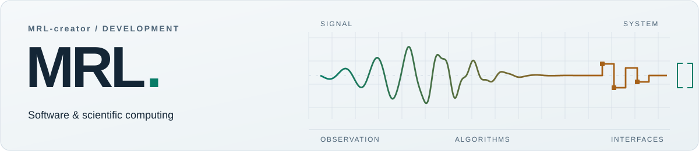

<picture>
  <source media="(prefers-color-scheme: dark)" srcset="assets/header-dark.svg">
  <source media="(prefers-color-scheme: light)" srcset="assets/header-light.svg">
  
</picture>

# Ramal Maharramli

**Software development × geophysics.** I build scientific Python tools, interactive data workstations, and practical automation — with C projects exploring game logic and search algorithms.

[Selected work](#selected-work) &nbsp; / &nbsp; [About](#about) &nbsp; / &nbsp; [Activity](#activity) &nbsp; / &nbsp; [LinkedIn](https://www.linkedin.com/in/ramal-maharramli-040260330/)

---

## Selected work

| Project | What’s inside |
| :--- | :--- |
| **[Seismic Wave Simulator](https://github.com/MRL-creator/seismic-wave-simulator)** NUMERICAL MODELING · Python / NumPy / Plotly | An educational 2D elastic wave model with P- and S-dominant sources and layered materials. A vectorized finite-difference solver uses CFL-based time steps; the interface exposes wavefields and receiver traces. |
| **[Earthquake Data Explorer](https://github.com/MRL-creator/earthquake-data-explorer)** DATA &amp; APIs · Python / Pandas / Streamlit | Explore real USGS catalog records through maps, filters, and descriptive statistics. Bounded-timeout API requests, CSV export, and a bundled catalog snapshot support both live and offline workflows. |
| **[Seismic Signal Analyzer](https://github.com/MRL-creator/seismic-signal-analyzer)** SIGNAL PROCESSING · Python / SciPy / Plotly | Inspect waveform CSVs with Butterworth filtering, FFT spectra, and spectrograms. Sampling checks guard frequency-domain analysis; reusable modules separate processing from the interface. |
| **[Connect Four](https://github.com/MRL-creator/Connect-Four-Game-C-Language)** SEARCH ALGORITHMS · C | Terminal PvP and PvAI with selectable search depth. Minimax with alpha-beta pruning scores candidate moves using a board evaluation function. |
| **[Gmail Cleaner](https://github.com/MRL-creator/gmail-cleaner)** AUTOMATION · JavaScript / Google Apps Script | Trash older verification codes and login links in bounded batches. Dry-run mode previews changes, with checks to skip starred and important messages. |

More projects

- **[Snake](https://github.com/MRL-creator/Snake-Game-in-C-Terminal-Based-)** — a C terminal game with keyboard input, collision handling, and increasing difficulty.
- **[Attendance Tracker](https://github.com/MRL-creator/attendance-tracker)** — an offline Windows attendance tool with CSV storage; available as a packaged release.
- **[Personal portfolio](https://github.com/MRL-creator/MRL-creator.github.io)** — an HTML, CSS, and JavaScript site presenting the projects in more detail.

## Tools in use

| Area | Technologies used in my repositories |
| :--- | :--- |
| Languages | **Python · C · JavaScript** |
| Scientific computing | NumPy · SciPy · Pandas |
| Interfaces &amp; automation | Streamlit · Plotly · HTML / CSS · Google Apps Script |
| Development | Git · GitHub · pytest / unittest |

## About

I study **Geophysics Engineering at the French-Azerbaijani University (UFAZ)** and serve as **Vice President of the UFAZ Programming Club**, where I have organized and taught Python courses.

My recent work connects geophysics with software: analyzing waveforms, exploring earthquake catalogs, and modeling simplified wave propagation. The scientific projects keep their calculations in reusable Python modules behind interactive interfaces.

## Activity

[Recent repository updates](https://github.com/MRL-creator?tab=repositories&sort=updated) &nbsp; / &nbsp; [Contribution history](https://github.com/MRL-creator?tab=overview#contribution-activity)

## Connect

[LinkedIn](https://www.linkedin.com/in/ramal-maharramli-040260330/) &nbsp; / &nbsp; [GitHub](https://github.com/MRL-creator)

MRL-creator · Geophysics × programming
