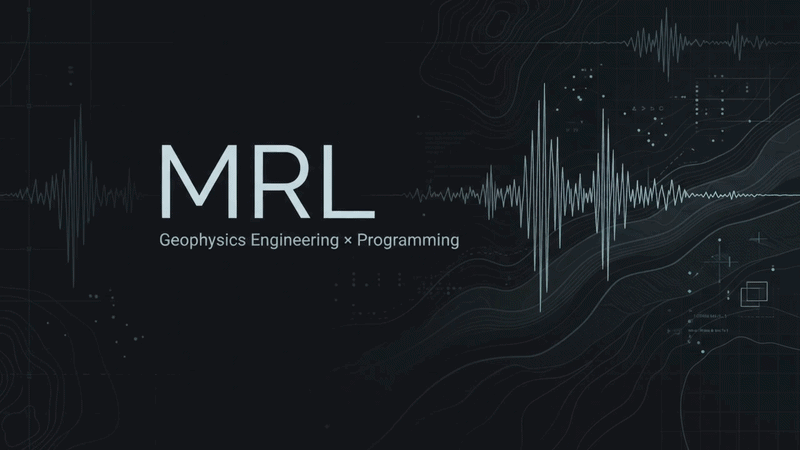

<div align="center">

# Ramal Maharramli

### Geophysics Engineering · Programming · Scientific Computing

<a href="https://github.com/MRL-creator?tab=repositories">PROJECT STREAM</a> &nbsp;·&nbsp;
<a href="https://github.com/MRL-creator">GITHUB ACTIVITY</a> &nbsp;·&nbsp;
<a href="https://az.linkedin.com/in/ramal-maharramli-040260330">LINKEDIN</a>

<br>



<br>


</div>

---

## Field readout

I study **Geophysics Engineering at UFAZ**, where I’m interested in how computation can help make sense of the Earth. I like turning ideas into practical software, from small terminal games to tools that organize everyday work.

```text
SIGNAL PATH   Earth science → data → models → code
LANGUAGES     C · Python · JavaScript · HTML
TOOLKIT       Google Apps Script · CSV · PyInstaller
```

## Signal route

<div align="center">

<strong>EARTH</strong> &nbsp;→&nbsp; SIGNALS &nbsp;→&nbsp; DATA &nbsp;→&nbsp; MODELS &nbsp;→&nbsp; CODE &nbsp;→&nbsp; INSIGHT

</div>

## Build log

<details open>
<summary><strong>Connect Four</strong> · C · minimax with alpha-beta pruning</summary>

<p>A terminal game with player-versus-player and player-versus-AI modes. The AI searches a limited number of moves ahead, prunes branches with alpha-beta, and scores board positions with a heuristic.</p>

<a href="https://github.com/MRL-creator/Connect-Four-Game-C-Language">Explore the repository →</a>

</details>

<details>
<summary><strong>Gmail Cleaner</strong> · JavaScript · Google Apps Script</summary>

<p>Finds older verification-code and login-link emails, offers a dry run, and protects starred or important messages before moving matching threads to Trash.</p>

<a href="https://github.com/MRL-creator/gmail-cleaner">Explore the repository →</a>

</details>

<details>
<summary><strong>Attendance Tracker</strong> · Python · CSV</summary>

<p>An offline Windows desktop app for recording and managing attendance data in CSV files.</p>

<a href="https://github.com/MRL-creator/attendance-tracker">Explore the repository →</a>

</details>

<details>
<summary><strong>Snake</strong> · C · terminal game</summary>

<p>A terminal Snake game with keyboard controls, collision handling, and increasing speed as food is collected.</p>

<a href="https://github.com/MRL-creator/Snake-Game-in-C-Terminal-Based-">Explore the repository →</a>

</details>

## Lab notes

- **Geophysics:** Geophysics Engineering student at UFAZ.
- **Community:** Vice President of the UFAZ Programming Club; organized and taught Python courses.
- **Competition:** Participant in the ICSC 2026 Qualification Round.
- **Currently exploring:** Python, algorithms, data structures, and scientific computing.

<div align="center">

<br>

`LEARN` &nbsp;·&nbsp; `BUILD` &nbsp;·&nbsp; `UNDERSTAND` &nbsp;·&nbsp; `IMPROVE`

</div>
